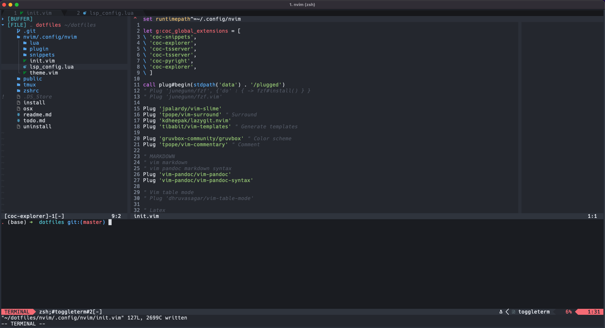

### My dotfiles

#### Screen shot

#### Installation

Install these programs manually
1. zsh: 
2. nvim: 
3. fuzzy: 

To install, git clone this into your machine, then run 

`$ ./osx [install|uninstall]`

Install will use stow to do smart symlink for each of the specified directory to the correct places.  
Only tested on macOS.

